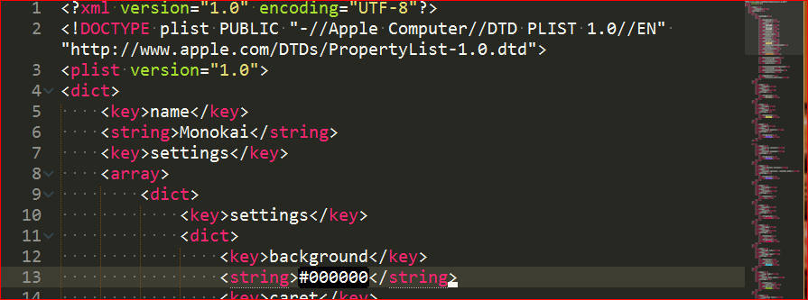
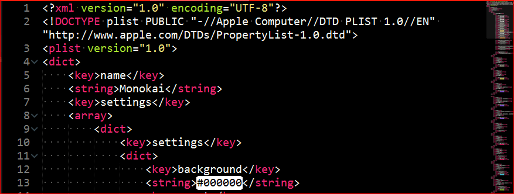

# Monokai-Dark.tmTheme

##Changed background color of Monokai.tmTheme to black

``` json
<dict>
    <key>name</key>
    <string>Monokai</string>
    <key>settings</key>
    <array>
        <dict>
            <key>settings</key>
            <dict>
                <key>background</key>
                <string>#000000</string>
```

###Background is faded black



###Background is black




